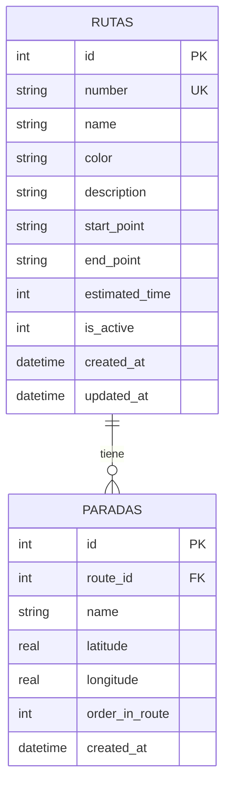
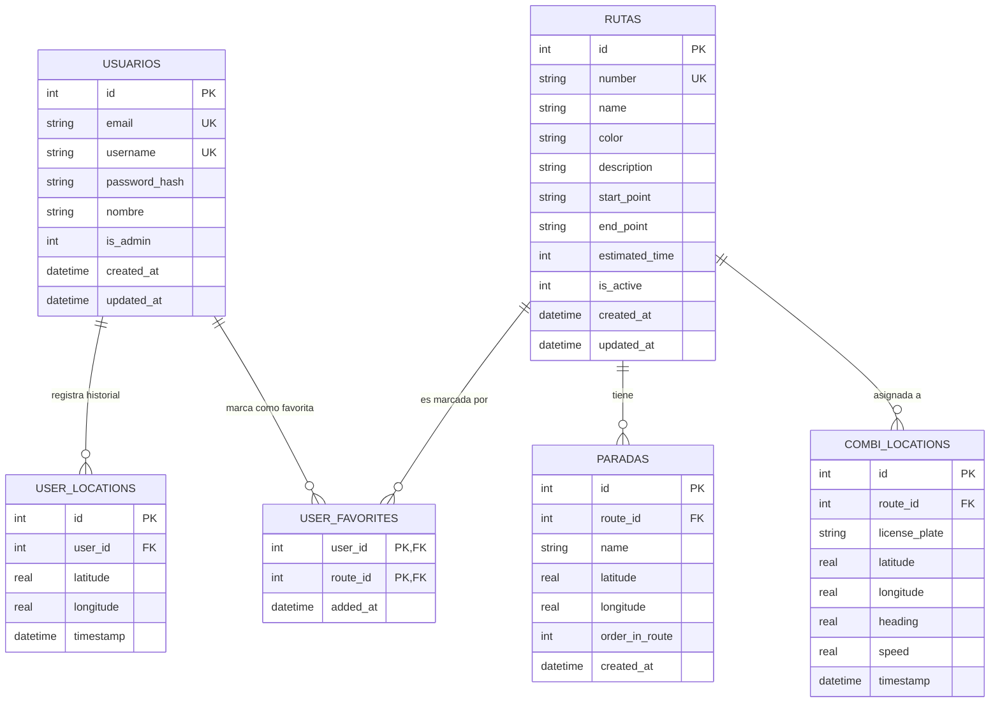

# Combis App — Schema de Base de Datos y Guía de Datos

Este documento define la fuente de verdad para el manejo de datos en la aplicación: el esquema SQLite local, los modelos Dart correspondientes y el plan de migración hacia el backend en la nube. 

> **Estado actual — Sistema de dibujo/rutas inicial, Sistema de manejo de "informacion persistente local" en moción.

---

## 1. Visión General: Capas de Datos

El diseño de datos se puede desarrollar en tres capas que se activan progresivamente:

```
Fase 3b  →  SQLite local       rutas + paradas (solo lectura para usuarios)
Fase 4   →  SQLite local       + user_favorites (escritura local)
Fase 4+  →  Backend REST       fuente de verdad (PostgreSQL/MySQL en servidor)
           SQLite local        cache offline del backend
Fase 5   →  Backend REST       + combi_locations (tiempo real)
```

---

## 2. Diagrama Entidad-Relación

### 2a. Core de Rutas y Paradas (Fase 3b)

Las dos tablas fundamentales que reemplazan a `route_data.dart`.



---

### 2b. Sistema Completo con Usuarios (conceptual)



---

## 3. Esquema SQL

### Tablas mínimas viable

```sql
-- TABLA: rutas
-- Equivalente a RouteOverlay en route_data.dart, pero persistente y editable.
CREATE TABLE rutas (
  id            INTEGER PRIMARY KEY AUTOINCREMENT,
  number        TEXT    NOT NULL UNIQUE,     -- "A", "3", "C2"
  name          TEXT    NOT NULL,            -- "Centro → Volcanes"
  color         TEXT    NOT NULL,            -- Hex: "#FF6D00"
  description   TEXT,
  start_point   TEXT    NOT NULL,
  end_point     TEXT    NOT NULL,
  estimated_time INTEGER NOT NULL,           -- en minutos
  is_active     INTEGER NOT NULL DEFAULT 1,  -- 0 = desactivada, no se muestra
  created_at    TEXT    NOT NULL,
  updated_at    TEXT    NOT NULL
);

-- TABLA: paradas (stops)
-- Equivalente a StopPoint en route_data.dart.
-- order_in_route define el orden de dibujo de la polilínea.
CREATE TABLE paradas (
  id             INTEGER PRIMARY KEY AUTOINCREMENT,
  route_id       INTEGER NOT NULL,
  name           TEXT    NOT NULL,
  latitude       REAL    NOT NULL,
  longitude      REAL    NOT NULL,
  order_in_route INTEGER NOT NULL,
  created_at     TEXT    NOT NULL,
  FOREIGN KEY (route_id) REFERENCES rutas (id) ON DELETE CASCADE
);
```

### Tablas de Fase 4+ (usuarios y favoritos)

```sql
-- TABLA: usuarios
CREATE TABLE usuarios (
  id            INTEGER PRIMARY KEY AUTOINCREMENT,
  email         TEXT NOT NULL UNIQUE,
  username      TEXT NOT NULL UNIQUE,
  password_hash TEXT NOT NULL,
  nombre        TEXT NOT NULL,
  is_admin      INTEGER NOT NULL DEFAULT 0,
  created_at    TEXT NOT NULL,
  updated_at    TEXT NOT NULL
);

-- TABLA: user_favorites (relación muchos a muchos)
CREATE TABLE user_favorites (
  user_id   INTEGER NOT NULL,
  route_id  INTEGER NOT NULL,
  added_at  TEXT    NOT NULL,
  PRIMARY KEY (user_id, route_id),
  FOREIGN KEY (user_id)  REFERENCES usuarios (id) ON DELETE CASCADE,
  FOREIGN KEY (route_id) REFERENCES rutas    (id) ON DELETE CASCADE
);

-- TABLA: user_locations (historial de ubicaciones — analytics)
CREATE TABLE user_locations (
  id        INTEGER PRIMARY KEY AUTOINCREMENT,
  user_id   INTEGER NOT NULL,
  latitude  REAL    NOT NULL,
  longitude REAL    NOT NULL,
  timestamp TEXT    NOT NULL,
  FOREIGN KEY (user_id) REFERENCES usuarios (id) ON DELETE CASCADE
);
```

### Tabla de Fase 5 (tiempo real)

```sql
-- TABLA: combi_locations
-- En SQLite local actúa como cache de la última posición conocida.
-- En el backend es la tabla de escritura en tiempo real.
CREATE TABLE combi_locations (
  id            INTEGER PRIMARY KEY AUTOINCREMENT,
  route_id      INTEGER NOT NULL,
  license_plate TEXT    NOT NULL,
  latitude      REAL    NOT NULL,
  longitude     REAL    NOT NULL,
  heading       REAL,               -- dirección en grados (0–360), nullable
  speed         REAL,               -- km/h, nullable
  timestamp     TEXT    NOT NULL,
  FOREIGN KEY (route_id) REFERENCES rutas (id) ON DELETE CASCADE
);
```

---

## 4. Modelos Dart

Estos modelos van en `lib/models/`. Los de Fase 1 (`route.dart`, `point.dart`) se actualizan para alinearse con el esquema definitivo.

### `AppRoute` — `lib/models/route.dart`

Mapea la tabla `rutas`. Las paradas se cargan como lista relacionada.

```dart
class AppRoute {
  final int id;
  final String number;       // "A", "3", "C2"
  final String name;         // "Centro → Volcanes"
  final String color;        // "#FF6D00"
  final String? description;
  final String startPoint;
  final String endPoint;
  final int estimatedTime;   // minutos
  final bool isActive;
  final DateTime createdAt;
  final DateTime updatedAt;
  final List<StopPoint> stops; // cargadas por JOIN o consulta separada

  const AppRoute({
    required this.id,
    required this.number,
    required this.name,
    required this.color,
    this.description,
    required this.startPoint,
    required this.endPoint,
    required this.estimatedTime,
    required this.isActive,
    required this.createdAt,
    required this.updatedAt,
    this.stops = const [],
  });

  factory AppRoute.fromMap(Map<String, dynamic> map) => AppRoute(
    id: map['id'],
    number: map['number'],
    name: map['name'],
    color: map['color'],
    description: map['description'],
    startPoint: map['start_point'],
    endPoint: map['end_point'],
    estimatedTime: map['estimated_time'],
    isActive: map['is_active'] == 1,
    createdAt: DateTime.parse(map['created_at']),
    updatedAt: DateTime.parse(map['updated_at']),
  );

  Map<String, dynamic> toMap() => {
    'number': number,
    'name': name,
    'color': color,
    'description': description,
    'start_point': startPoint,
    'end_point': endPoint,
    'estimated_time': estimatedTime,
    'is_active': isActive ? 1 : 0,
    'created_at': createdAt.toIso8601String(),
    'updated_at': updatedAt.toIso8601String(),
  };
}
```

### `StopPoint` — `lib/models/stop_point.dart`

> ⚠️ En Fase 3 `StopPoint` vive en `data/route_data.dart` con campos mínimos. En Fase 3b se mueve aquí con el schema completo.

```dart
import 'package:latlong2/latlong.dart';

class StopPoint {
  final int id;
  final int routeId;
  final String name;
  final double latitude;
  final double longitude;
  final int orderInRoute;
  final DateTime createdAt;

  const StopPoint({
    required this.id,
    required this.routeId,
    required this.name,
    required this.latitude,
    required this.longitude,
    required this.orderInRoute,
    required this.createdAt,
  });

  // Helper para flutter_map
  LatLng get latLng => LatLng(latitude, longitude);

  factory StopPoint.fromMap(Map<String, dynamic> map) => StopPoint(
    id: map['id'],
    routeId: map['route_id'],
    name: map['name'],
    latitude: map['latitude'],
    longitude: map['longitude'],
    orderInRoute: map['order_in_route'],
    createdAt: DateTime.parse(map['created_at']),
  );

  Map<String, dynamic> toMap() => {
    'route_id': routeId,
    'name': name,
    'latitude': latitude,
    'longitude': longitude,
    'order_in_route': orderInRoute,
    'created_at': createdAt.toIso8601String(),
  };
}
```

---

## 5. Consultas de Referencia

Okay okay, entiendo que la base de datos es tablas y mamada y media, pero. *¿Como interactuo con ella?*


---

## 6. Datos de Siembra

El archivo `lib/utils/seeder.dart` pobla la BD si está vacía. Las 3 rutas de `route_data.dart` se convierten en la siembra inicial con coordenadas reales de Chiautempan (~19.306°N, -98.187°O).

**Ejemplo de entrada para ruta A:**

```dart
// En seeder.dart
final rutaA = AppRoute(
  id: 0,                              // AUTOINCREMENT, ignorado en INSERT
  number: 'A',
  name: 'Centro → Volcanes',
  color: '#FF6D00',                   // AppColors.pumpkinSpice
  startPoint: 'Zócalo de Chiautempan',
  endPoint: 'Volcanes',
  estimatedTime: 25,
  isActive: true,
  createdAt: DateTime.now(),
  updatedAt: DateTime.now(),
);
```

---

## 7. Notas de Plataforma

**SQLite en Android (`sqflite`):** funciona directo, sin configuración adicional.

**SQLite en Linux de escritorio (`sqflite_common_ffi`):** requiere el paquete `sqflite_common_ffi` y un bloque de init en `main.dart`. Puede tener fricciones en Windows dependiendo de la configuración de CMake.

**Migración a la nube (Fase 4+):** cuando el backend esté activo, SQLite local pasa a ser un cache de solo lectura. La fuente de verdad se mueve al servidor. El `DatabaseHelper` se refactoriza para sincronizar desde la API REST en lugar de sembrar localmente.