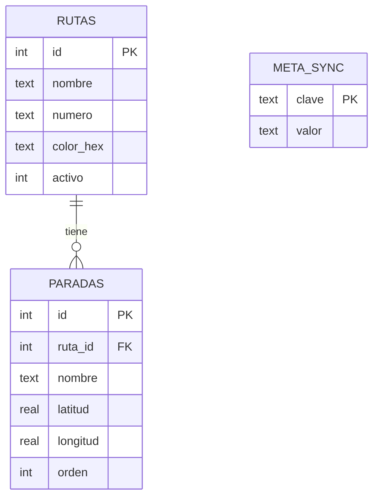

# Combis App — Schema de Base de Datos

> Fuente de verdad para la capa de datos. Estado actual: **Fase 5 — servidor y capa de datos completa.**

---

## 1. Dos Capas de Datos

El sistema tiene dos bases de datos con propósitos distintos:

| | SQLite local (`combis_cache.db`) | MySQL en `mechyserver` |
|---|---|---|
| **Rol** | Cache offline de solo lectura | Fuente de verdad |
| **Quién escribe** | Solo la app, al hacer sync | El equipo, vía migraciones |
| **Datos** | Rutas y paradas públicas | Rutas, paradas, usuarios (futuro) |
| **Acceso desde Dart** | `sqflite` / `sqflite_common_ffi` | Vía API REST (`combiapi/`) |

La app **nunca escribe datos de rutas directamente**. Los recibe del servidor mediante `sync.php` y los reemplaza en SQLite de forma atómica con `replaceAll()` dentro de una transacción.

---

## 2. Esquema SQLite (cache local)

`DatabaseHelper` (`lib/database/database_helper.dart`) crea estas tablas. Los nombres de campos usan **español** — los modelos Dart mapean las claves al deserializar desde el JSON del servidor.

```sql
-- Rutas de transporte público (datos públicos, cacheables)
CREATE TABLE rutas (
  id        INTEGER PRIMARY KEY,             -- permanente, nunca renumerar
  nombre    TEXT    NOT NULL,                -- "Centro → Volcanes"
  numero    TEXT    NOT NULL,                -- "A", "B", "C"
  color_hex TEXT    NOT NULL DEFAULT '#FF6D00',
  activo    INTEGER NOT NULL DEFAULT 1       -- 0 = en mantenimiento, no se muestra
);

-- Paradas ordenadas por ruta (definen la polilínea en el mapa)
CREATE TABLE paradas (
  id        INTEGER PRIMARY KEY,
  ruta_id   INTEGER NOT NULL REFERENCES rutas(id) ON DELETE CASCADE,
  nombre    TEXT    NOT NULL,
  latitud   REAL    NOT NULL,
  longitud  REAL    NOT NULL,
  orden     INTEGER NOT NULL                -- 0 = inicio de ruta
);

-- Metadatos de sincronización
CREATE TABLE meta_sync (
  clave TEXT PRIMARY KEY,
  valor TEXT NOT NULL
  -- Claves conocidas:
  -- "schema_version" → versión del servidor en el último sync exitoso
  -- "last_sync"      → timestamp ISO 8601 del último sync
);
```

### Diagrama ER (SQLite)


```mermaid
erDiagram
    RUTAS {
        int id PK
        text nombre
        text numero
        text color_hex
        int activo
    }
    PARADAS {
        int id PK
        int ruta_id FK
        text nombre
        real latitud
        real longitud
        int orden
    }
    META_SYNC {
        text clave PK
        text valor
    }

    RUTAS ||--o{ PARADAS : "tiene"
```

---

## 3. Esquema MySQL (servidor — fuente de verdad)

Base de datos `combis_db` en `mechyserver`. Los campos usan **inglés**, coherente con las claves JSON que devuelve la API.

```sql
-- Rutas de transporte (datos públicos, cacheables)
CREATE TABLE rutas (
  id             INT AUTO_INCREMENT PRIMARY KEY,
  number_code    VARCHAR(10)   NOT NULL UNIQUE,    -- "A", "B", "C"
  name           VARCHAR(100)  NOT NULL,
  color          VARCHAR(7)    NOT NULL,            -- hex: #FF6D00
  description    TEXT,
  start_point    VARCHAR(100)  NOT NULL,
  end_point      VARCHAR(100)  NOT NULL,
  estimated_time INT           NOT NULL,            -- minutos
  is_active      TINYINT       NOT NULL DEFAULT 1,
  created_at     TIMESTAMP     DEFAULT CURRENT_TIMESTAMP,
  updated_at     TIMESTAMP     DEFAULT CURRENT_TIMESTAMP ON UPDATE CURRENT_TIMESTAMP
);

-- Paradas ordenadas por ruta
CREATE TABLE paradas (
  id             INT AUTO_INCREMENT PRIMARY KEY,
  route_id       INT           NOT NULL,
  name           VARCHAR(100)  NOT NULL,
  latitude       DECIMAL(10,7) NOT NULL,
  longitude      DECIMAL(10,7) NOT NULL,
  order_in_route INT           NOT NULL,
  created_at     TIMESTAMP     DEFAULT CURRENT_TIMESTAMP,
  FOREIGN KEY (route_id) REFERENCES rutas(id) ON DELETE CASCADE
);

-- Usuarios (esquema listo, vacío en V1 — auth se implementa en Fase 4)
CREATE TABLE usuarios (
  id            INT AUTO_INCREMENT PRIMARY KEY,
  email         VARCHAR(255) NOT NULL UNIQUE,
  username      VARCHAR(50)  NOT NULL UNIQUE,
  password_hash VARCHAR(255) NOT NULL,
  nombre        VARCHAR(100) NOT NULL,
  is_admin      TINYINT      NOT NULL DEFAULT 0,
  created_at    TIMESTAMP    DEFAULT CURRENT_TIMESTAMP,
  updated_at    TIMESTAMP    DEFAULT CURRENT_TIMESTAMP ON UPDATE CURRENT_TIMESTAMP
);
```

### Datos sembrados actualmente

**Rutas (3 filas):**

| id | number_code | name | color | estimated_time |
|----|-------------|------|-------|----------------|
| 1 | A | Centro → Volcanes | #FF6D00 | 25 min |
| 2 | B | Ocotlán → Centro | #1E88E5 | 20 min |
| 3 | C | (tercera ruta) | — | — |

**Paradas:** 9 filas — 3 por ruta, con coordenadas reales de la zona Chiautempan–Tlaxcala (~19.306°N, -98.187°O).

---

## 4. Modelos Dart

Los modelos viven en `lib/models/`. Cada uno implementa tres variantes de constructor:

| Método | Dirección | Claves |
|--------|-----------|--------|
| `fromMap` / `toMap` | SQLite ↔ Dart | Español (`nombre`, `ruta_id`, `orden`…) |
| `fromJson` | API → Dart (`sync.php`) | Inglés (`name`, `route_id`, `order_in_route`…) |
| `fromJsonEmbedded` | API → Dart (`routes.php`) | Inglés, estructura simplificada (`lat`, `lng`, `order`) |

### `Ruta` — `lib/models/ruta.dart`

```dart
class Ruta {
  final int id;
  final String nombre;
  final String numero;   // "A", "B", "C"
  final String colorHex; // "#FF6D00"
  final bool activo;

  const Ruta({
    required this.id,
    required this.nombre,
    required this.numero,
    required this.colorHex,
    required this.activo,
  });

  // SQLite → Dart
  factory Ruta.fromMap(Map<String, dynamic> map) => Ruta(
    id:       map['id'],
    nombre:   map['nombre'],
    numero:   map['numero'],
    colorHex: map['color_hex'],
    activo:   map['activo'] == 1,
  );

  // Dart → SQLite
  Map<String, dynamic> toMap() => {
    'id':        id,
    'nombre':    nombre,
    'numero':    numero,
    'color_hex': colorHex,
    'activo':    activo ? 1 : 0,
  };

  // API → Dart (sync.php)
  factory Ruta.fromJson(Map<String, dynamic> json) => Ruta(
    id:       json['id'],
    nombre:   json['name'],
    numero:   json['number_code'],
    colorHex: json['color'],
    activo:   json['is_active'] == 1,
  );
}
```

### `Parada` — `lib/models/parada.dart`

```dart
class Parada {
  final int id;
  final int rutaId;
  final String nombre;
  final double latitud;
  final double longitud;
  final int orden;

  const Parada({
    required this.id,
    required this.rutaId,
    required this.nombre,
    required this.latitud,
    required this.longitud,
    required this.orden,
  });

  // SQLite → Dart
  factory Parada.fromMap(Map<String, dynamic> map) => Parada(
    id:       map['id'],
    rutaId:   map['ruta_id'],
    nombre:   map['nombre'],
    latitud:  map['latitud'],
    longitud: map['longitud'],
    orden:    map['orden'],
  );

  // Dart → SQLite
  Map<String, dynamic> toMap() => {
    'id':       id,
    'ruta_id':  rutaId,
    'nombre':   nombre,
    'latitud':  latitud,
    'longitud': longitud,
    'orden':    orden,
  };

  // API → Dart (sync.php — paradas en array separado con campos completos)
  factory Parada.fromJson(Map<String, dynamic> json) => Parada(
    id:       json['id'],
    rutaId:   json['route_id'],
    nombre:   json['name'],
    latitud:  json['latitude'],
    longitud: json['longitude'],
    orden:    json['order_in_route'],
  );

  // API → Dart (routes.php — paradas embebidas en el objeto ruta, campos cortos)
  factory Parada.fromJsonEmbedded(Map<String, dynamic> json, int rutaId) => Parada(
    id:       json['id'],
    rutaId:   rutaId,
    nombre:   json['name'],
    latitud:  json['lat'],
    longitud: json['lng'],
    orden:    json['order'],
  );
}
```

---

## 5. Consultas de Referencia

Queries más usadas del `DatabaseHelper` (`lib/database/database_helper.dart`):

### Rutas activas

```dart
Future<List<Ruta>> obtenerRutas() async {
  final db = await database;
  final maps = await db.query('rutas', where: 'activo = ?', whereArgs: [1]);
  return maps.map(Ruta.fromMap).toList();
}
```

### Paradas de una ruta (en orden)

```dart
Future<List<Parada>> obtenerParadasDeRuta(int rutaId) async {
  final db = await database;
  final maps = await db.query(
    'paradas',
    where: 'ruta_id = ?',
    whereArgs: [rutaId],
    orderBy: 'orden ASC',
  );
  return maps.map(Parada.fromMap).toList();
}
```

### Leer / escribir `meta_sync`

```dart
Future<String?> leerMeta(String clave) async {
  final db = await database;
  final rows = await db.query('meta_sync', where: 'clave = ?', whereArgs: [clave]);
  return rows.isEmpty ? null : rows.first['valor'] as String;
}

Future<void> escribirMeta(String clave, String valor) async {
  final db = await database;
  await db.insert(
    'meta_sync',
    {'clave': clave, 'valor': valor},
    conflictAlgorithm: ConflictAlgorithm.replace,
  );
}
```

### Reemplazar todo el cache (sync atómico)

```dart
// replaceAll() en database_helper.dart
// Transacción: si algo falla, SQLite queda intacto — sin estado inconsistente
Future<void> replaceAll(List<Ruta> rutas, List<Parada> paradas) async {
  final db = await database;
  await db.transaction((txn) async {
    await txn.delete('paradas');
    await txn.delete('rutas');
    for (final r in rutas) await txn.insert('rutas', r.toMap());
    for (final p in paradas) await txn.insert('paradas', p.toMap());
  });
}
```

---

## 6. Datos de Siembra (Fallback Offline)

`lib/data/seed_data.dart` contiene datos hardcodeados para el primer arranque sin conectividad. Los IDs son permanentes y coinciden exactamente con los sembrados en MySQL.

- **Rutas:** IDs 1, 2, 3
- **Paradas:** IDs en rango 101–303

**Regla:** Los IDs son constantes. No renumerar sin una migración que actualice las FKs en MySQL — los favoritos de usuarios apuntan al `id` de la ruta, no a su nombre.

---

## 7. Tablas Futuras (Fase 4+)

Cuando se implemente auth y favoritos, estas tablas se agregan **solo a MySQL**. Los datos sensibles de usuario nunca van al dispositivo.

```sql
-- Favoritos de usuario (MySQL únicamente)
CREATE TABLE user_favorites (
  user_id  INT NOT NULL,
  route_id INT NOT NULL,
  added_at TIMESTAMP DEFAULT CURRENT_TIMESTAMP,
  PRIMARY KEY (user_id, route_id),
  FOREIGN KEY (user_id)  REFERENCES usuarios(id) ON DELETE CASCADE,
  FOREIGN KEY (route_id) REFERENCES rutas(id)    ON DELETE CASCADE
);
```

---

## 8. Notas de Plataforma

- **Android** (`sqflite`): funciona sin configuración adicional.
- **Linux / Windows desktop** (`sqflite_common_ffi`): requiere el bloque de init en `main.dart` antes de cualquier operación SQLite.
- **Migración de esquema SQLite**: si cambias las tablas, incrementar `dbVersion` en `DatabaseHelper` e implementar `onUpgrade`. No resetear IDs.
- **Contraseña MySQL**: el `common.php` del repo tiene un placeholder. La contraseña real en el servidor es diferente y cumple con `validate_password`. Mover a `getenv()` antes de producción.
